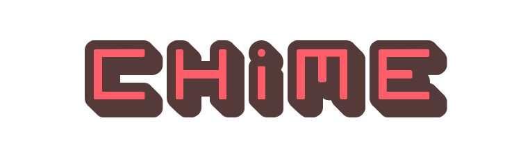

-
:wind_chime: Extracts versions from CHANGELOG.md, builds via Maven and releases to Github and Central.

**:package: [Getting started](#getting-started) |**
**:rocket: [License](#license) |**
**:pencil: [Changelog](CHANGELOG.md)**

---

# Getting started

# License

This software is licensed under the [Apache 2 License](LICENSE).
